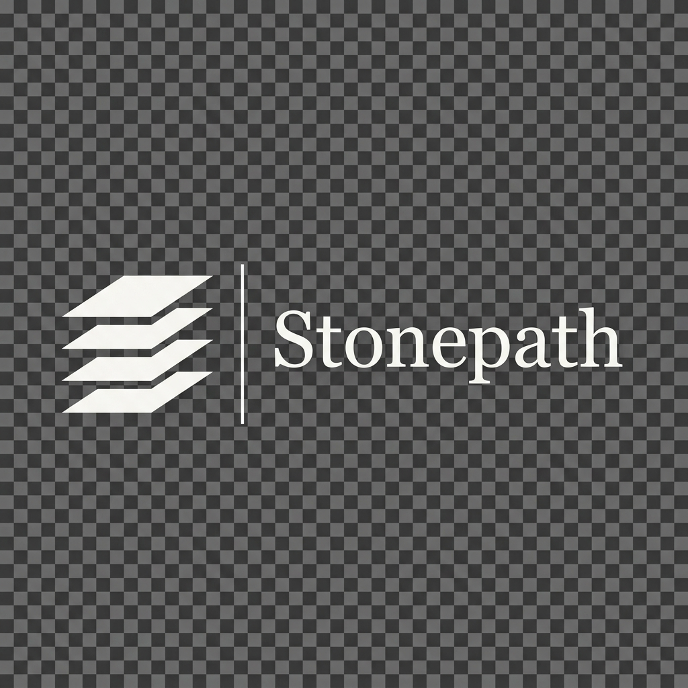

<div align="center">

<!-- ANIMATED HEADER BANNER -->


<!-- TYPING EFFECT -->
<a href="https://git.io/typing-svg">
  
</a>

<br/>

<!-- LOCATION & STATUS BADGES -->
<p>
  
  &nbsp;
  
  &nbsp;
  
</p>

<!-- PROFILE VIEWS + SOCIAL QUICK LINKS -->
<p>
  
  &nbsp;
  <a href="https://linkedin.com/in/taimoor-khan-87501226a"></a>
  &nbsp;
  <a href="mailto:stonepathlab@gmail.com"></a>
  &nbsp;
  <a href="https://taimoor-portfolio-delta.vercel.app/"></a>
</p>

</div>

---

<!-- SECTION DIVIDER STYLING -->
<div align="center">
  
</div>

<br/>

## About

<table>
<tr>
<td width="60%" valign="top">

> **I don't build demos. I build systems that go to production.**
>
> *Most AI engineers stop at the model. I start there.*

I'm **Taimoor Khan** — an AI Engineer with deep expertise in architecting enterprise-grade machine learning pipelines, retrieval-augmented generation (RAG) systems, and deploying LLMs at scale.

My work sits at the intersection of **ML research and production engineering** — taking models from notebooks to reliable, observable, cost-efficient systems that handle real users and real data.

I believe great AI engineering means obsessing over:
- **Reliability** — systems that don't break at 3am
- **Observability** — you can't fix what you can't measure
- **Scalability** — designed for 10x from day one
- **Precision** — the right model, the right context, the right output

Currently co-building **[Stonepath Labs](mailto:stonepathlab@gmail.com)** — an AI automation and enterprise systems company.

</td>
<td width="40%" valign="top" align="center">

<br/>

```yaml
name: Taimoor Khan
role: AI Engineer & Co-Founder
location: Pakistan 🇵🇰
company: Stonepath Labs

specializations:
  - LLM Systems & RAG Pipelines
  - MLOps & Production ML
  - NLP & Information Extraction
  - Computer Vision Systems

current_focus:
  - Enterprise AI Automation
  - Multi-agent LLM Architectures
  - GPU-accelerated Inference
```

</td>
</tr>
</table>

<br/>

---

<div align="center">
  
</div>

<br/>

## Tech Stack

<br/>

### 🧠 &nbsp; AI / ML Core

<p>
  
  
  
  
  
  
  
</p>

### 🔗 &nbsp; LLM & RAG Systems

<p>
  
  
  
  
  
  
  
  
</p>

### ⚙️ &nbsp; MLOps & DevOps

<p>
  
  
  
  
  
  
  
  
</p>

### 🛠️ &nbsp; Backend & Infrastructure

<p>
  
  
  
  
  
  
  
</p>

<br/>

---

<div align="center">
  
</div>

<br/>

## Featured Projects

<br/>

<!-- PROJECT CARD 1 -->
<table>
<tr>
<td>

### 🏗️ &nbsp; Enterprise RAG Framework
**Production-grade Retrieval-Augmented Generation at scale**

A battle-tested RAG architecture built for enterprise deployments — supporting multi-tenant document ingestion, hybrid dense-sparse retrieval, reranking pipelines, and LLM-agnostic query synthesis. Handles 160K+ document corpora with sub-second P95 latency.

**Real-world Use Case** → Deployed as core intelligence layer for clinical decision support and enterprise knowledge bases.

<p>
  
  
  
  
  
  
</p>

</td>
</tr>
</table>

<br/>

<!-- PROJECT CARD 2 -->
<table>
<tr>
<td>

### 🔧 &nbsp; MLOps Forge
**End-to-end ML pipeline orchestration platform**

An MLOps platform enabling automated model training, versioning, evaluation, and deployment across cloud and on-prem environments. Features experiment tracking, data lineage, model registry, drift detection, and CI/CD integration — reducing time-to-production by 70%.

**Real-world Use Case** → Enables teams to ship ML models to production in hours, not weeks.

<p>
  
  
  
  
  
  
</p>

</td>
</tr>
</table>

<br/>

<!-- PROJECT CARD 3 -->
<table>
<tr>
<td>

### 📊 &nbsp; InsightForge NLP
**Intelligent document understanding and information extraction**

A modular NLP system for extracting structured intelligence from unstructured documents at scale — combining entity recognition, relation extraction, document classification, and semantic clustering. Powers automated reporting workflows across high-stakes domains.

**Real-world Use Case** → Processes clinical notes, legal documents, and financial reports — extracting structured facts with 94%+ accuracy.

<p>
  
  
  
  
  
</p>

</td>
</tr>
</table>

<br/>

<!-- PROJECT CARD 4 -->
<table>
<tr>
<td>

### 🦾 &nbsp; AI Model Zoo
**Unified hub for fine-tuned and production-ready ML models**

A curated collection of production-optimized models spanning computer vision, NLP, and multimodal tasks — each with benchmarks, deployment configs, quantization support, and inference endpoints. Designed for teams who need reliable models without the research overhead.

**Real-world Use Case** → Accelerates AI adoption in enterprise settings by providing plug-and-play, production-ready model pipelines.

<p>
  
  
  
  
  
</p>

</td>
</tr>
</table>

<br/>

---

<div align="center">
  
</div>

<br/>

## Stonepath Labs

<br/>

<table>
<tr>
<td width="20%" align="center" valign="middle">



</td>
<td width="80%" valign="top">

### &nbsp; Stonepath Labs &nbsp; `AI Implementation & Automation`

We help businesses adopt practical AI — not hype. Stonepath Labs builds intelligent systems and automation infrastructure for startups, clinics, agencies, and enterprises that want AI to actually work inside their operations.

> *"We don't sell AI. We build the systems that make it work."*

**What we implement:**

| Service | Description |
|---|---|
| 🔄 **AI Workflow Automation** | Replace repetitive manual processes with intelligent, reliable pipelines |
| 🧠 **RAG & Knowledge Systems** | Internal AI assistants trained on your own data and documents |
| 📄 **Document Intelligence** | Extract, classify, and act on information from unstructured documents |
| 🤝 **Customer Support AI** | Deploy AI agents that resolve queries with context and precision |
| 🔌 **AI Integrations** | Connect AI capabilities into your existing tools and workflows |
| 🎨 **AI-Assisted Content** | Scalable content and design solutions powered by frontier AI models |

**Who we work with:** Startups · Clinics · Agencies · Enterprises · Operations teams that know AI matters but don't know where to start.

<p>
  
  
  
  <a href="mailto:stonepathlab@gmail.com"></a>
</p>

</td>
</tr>
</table>

<br/>

---

<div align="center">
  
</div>

<br/>

## Let's Connect

<br/>

<div align="center">

<table>
<tr>
<td align="center" width="25%">

**LinkedIn**

[](https://linkedin.com/in/taimoor-khan-87501226a)

Professional network & work

</td>
<td align="center" width="25%">

**GitHub**

[](https://github.com/TaimoorKhan10)

Code, projects & contributions

</td>
<td align="center" width="25%">

**Email**

[](mailto:stonepathlab@gmail.com)

stonepathlab@gmail.com

</td>
<td align="center" width="25%">

**Portfolio**

[](https://taimoor-portfolio-delta.vercel.app/)

Projects & case studies

</td>
</tr>
</table>

<br/>

> **Open to:** Consulting engagements, technical advisory roles, and AI system collaborations.
>
> **Not open to:** Unpaid work, vague "partnership" offers, or generic recruitment messages.

<br/>


</div>

---

<div align="center">
  <sub>
    Crafted with precision by <strong>Taimoor Khan</strong> &nbsp;•&nbsp; Powered by production-grade engineering principles &nbsp;•&nbsp; © 2025 Stonepath Labs
  </sub>
</div>
